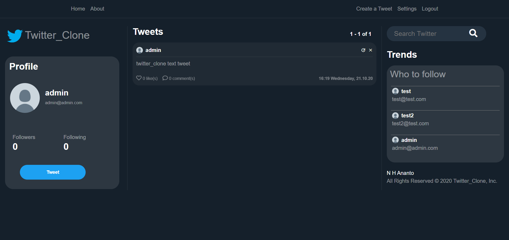

# twitter_clone
Clone of popular social network twitter using Django.

Demo Image:


## Setup
1. Git Clone the project with: ```https://github.com/nhananto/twitter_clone.git```
2. Create a new python enveronment with: ```python -m venv venv```
3. Activate enveronment with: ```venv\Scripts\activate```
4. Install required dependences with: ```pip install -r requirements.txt```
5. Make migrations with: ```python manage.py makemigrations``` and then ```python manage.py migrate```
5. Run app localy with: ```python manage.py runserver```

## Credit
This project is developped by Nazmul Hossain Ananto by the help of Redian Marku.
All rights reserved 2020
